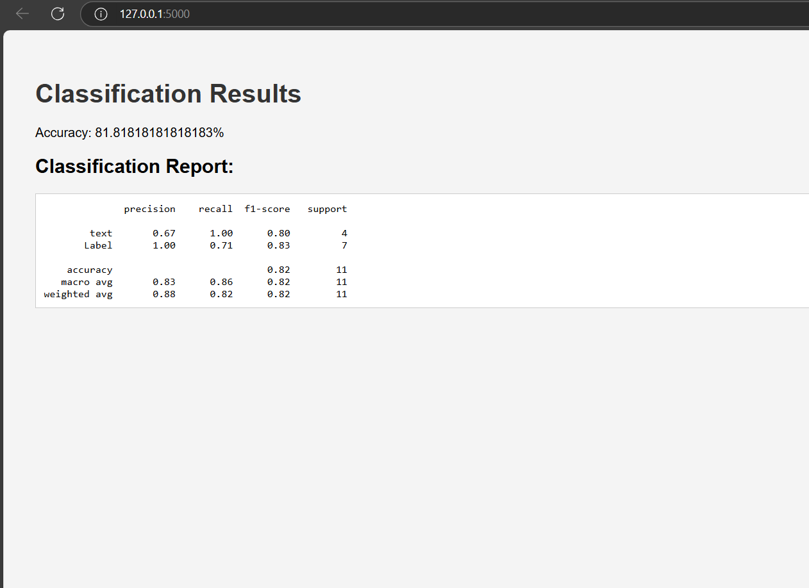
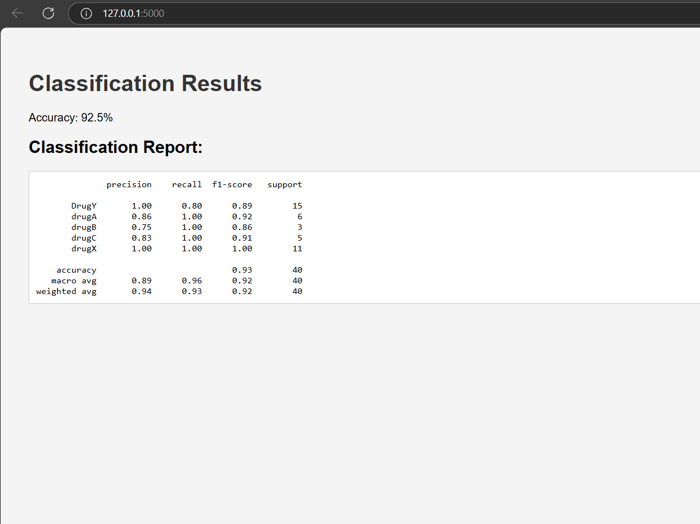

Công nghệ sử dụng:
Framework: pandas, sklearn

Thuật toán:
Naive Bayes
Naive Bayes là một thuật toán phân loại cho các vấn đề phân loại nhị phân (hai lớp) và đa lớp.
Thuật toán Naive Bayes tính xác suất cho các yếu tố, sau đó chọn kết quả với xác suất cao nhất.

Hiển thị kết quả lên website:
     
Câu 1:
     
     
Câu 2:
     

